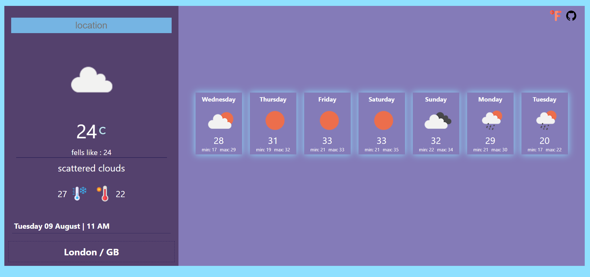
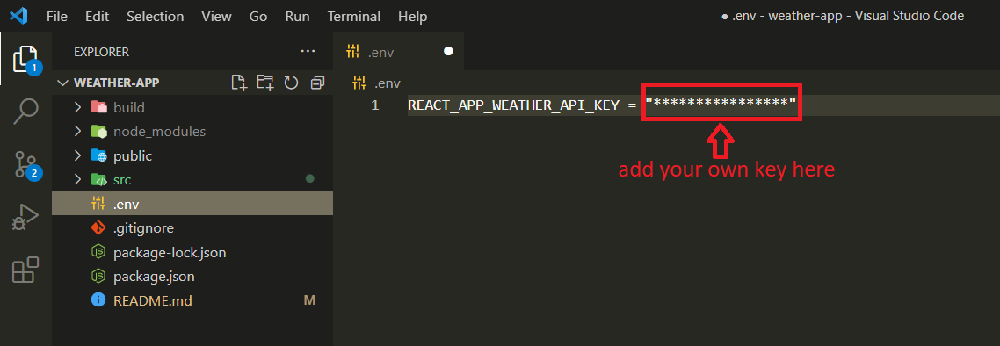

# **React Weather App**

---

[Try weather app](https://weather-app-515.pages.dev/)

---

## Dependencies

* axios
* context
* [https://api.openweathermap.org/data/2.5/weather?q={city name}&appid={API key}](https://openweathermap.org/current#name)
* [luxon](https://moment.github.io/luxon/#/?id=luxon)

---

## Run on your computer

 1. Clone project

        git clone https://github.com/muzaffercankaplan/wheather-app-React.git

  2. Add your openweather key

      

  3. Open a new terminal

          npm install OR yarn add

  4. Run start
   
          npm run start OR yarn run start 

  

    
  

  

